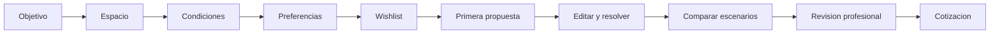

# 02. Usuarios, datos de entrada y experiencia

## Usuario primario recomendado

El primer producto debe optimizarse para **uso asistido por un asesor o paisajista junto al cliente**. Este enfoque permite aprender que preguntas importan sin exigir que un cliente no tecnico complete un levantamiento perfecto.

El autoservicio puede abrirse despues de observar sesiones reales, simplificar lenguaje y construir recuperacion de errores.

## Personas principales

| Persona | Necesidad | Riesgo de UX |
|---|---|---|
| Cliente explorador | Ver posibilidades sin compromiso | Abandona si se le pide precision demasiado pronto |
| Cliente decidido | Validar especies e idea propia | Se frustra si el sistema rechaza sin explicar |
| Asesor comercial | Crear propuesta rapido | Puede saltarse datos para cerrar la conversacion |
| Paisajista | Controlar calidad y composicion | Rechaza una caja negra que reemplaza criterio |
| Tecnico de terreno/riego | Recibir medidas y alcance confiables | Puede ejecutar sobre datos aproximados si no se distinguen |
| Finanzas/compras | Proteger margen y trazabilidad | Puede optimizar partidas tecnicamente necesarias |

## Estrategia de recoleccion de datos

Se aplica divulgacion progresiva: pedir solo lo necesario para producir el siguiente valor visible.

### Nivel A: entrada de baja friccion

Informacion necesaria para una primera propuesta conceptual:

| Dato | Forma recomendada | Por que importa |
|---|---|---|
| Comuna o ubicacion aproximada | Busqueda; direccion exacta opcional | Clima, proveedor de agua, disponibilidad regional |
| Forma y dimensiones del area | Rectangulo, dibujar poligono o cargar plano | Limite de ubicacion y escala |
| Casa y zonas no plantables | Bloques simples arrastrables | Distancias y superficie util |
| Sol | Pleno, parcial, sombra, "no se" | Filtro horticultural inicial |
| Objetivos | Sombra, privacidad, flores, mascotas, juego, bajo riego | Prioriza soluciones mejor que un estilo aislado |
| Estilo | Tarjetas visuales | Guia composicion y especies |
| Mantenimiento aceptable | Bajo, medio, alto | Evita propuestas que el cliente no sostendra |
| Presupuesto orientativo | Rango y "aun no se" | Evita una solucion comercialmente inviable |
| Wishlist | Especies o intenciones | Conserva deseos explicitos |

### Nivel B: antes de una precotizacion confiable

- norte u orientacion aproximada
- pendiente: plana, suave, fuerte o por zonas
- drenaje observado: rapido, normal, se encharca
- plantas existentes que se conservan o retiran
- tipo de suelo conocido o permiso para estimarlo
- fuente de agua y existencia de riego
- fotos desde angulos guiados
- accesos de obra y restricciones de condominio
- niños, mascotas o sensibilidad a plantas toxicas/espinas
- nivel de precision de cada medida

### Nivel C: antes de un plan tecnico o ejecucion

- levantamiento verificado y escala
- redes, ductos, fundaciones y servidumbres conocidas
- caudal y presion dinamica de agua
- material, diametro y ubicacion del punto de conexion
- cotas y pendientes relevantes
- analisis de suelo cuando corresponda
- inventario y estado de vegetacion existente
- restricciones municipales o comunitarias
- disponibilidad y precios vigentes de proveedores
- aprobacion profesional de layout, riego y cantidades

## Lo que no debemos pedir al inicio

- tarifa exacta de agua
- litros por planta
- coeficientes de riego
- nombres botanicos obligatorios
- coordenadas numericas de obstaculos
- diametros de tuberia
- datos personales no necesarios para guardar o contactar
- direccion exacta antes de explicar para que se utilizara

## Datos que el sistema puede inferir, pero debe permitir corregir

| Dato inferido | Fuente posible | Confirmacion del usuario |
|---|---|---|
| Proveedor y tarifa de agua | Comuna, area de concesion y tabla versionada | Mostrar proveedor y fecha |
| ETo y clima base | Estacion INIA/DMC cercana | Mostrar distancia y periodo |
| Especies aptas regionalmente | Catalogo + reglas climaticas | Profesional puede aprobar excepcion |
| Orientacion | Georreferencia o metadata del plano | Usuario corrige norte |
| Area | Geometria dibujada | Mostrar calculo y precision |
| Necesidad de riego | ETo, coeficiente, cobertura y eficiencia | Mostrar rango, no solo un numero |
| Costo | Tarifas + consumo incremental | Mostrar componentes y vigencia |

## Recorrido recomendado

## Pantallas y decisiones

### 1. Inicio

Debe explicar resultado, tiempo estimado y nivel de precision. El CTA principal es crear un proyecto; un ejemplo interactivo puede reducir miedo sin pedir cuenta.

### 2. Espacio

Tres entradas equivalentes:

- rapido: ancho y largo
- visual: dibujar limite y obstaculos
- asistido: subir plano/foto y calibrar con una medida conocida

El usuario siempre debe poder cambiar de metodo sin perder trabajo.

### 3. Condiciones y objetivos

Usar lenguaje observable: "recibe sol directo casi todo el dia" es mejor que exigir horas exactas. Incluir "no se" y convertirlo en una tarea pendiente, no en error.

### 4. Preferencias y wishlist

Permitir buscar por intencion y por especie. Cada opcion debe mostrar espacio maduro, agua relativa, mantenimiento y compatibilidad preliminar.

### 5. Propuesta

El plano es el centro. El panel lateral explica:

- que fue colocado
- que no fue colocado
- restricciones activas
- consumo y costo como rango
- supuestos pendientes
- acciones concretas

### 6. Editor drag-and-drop

Interacciones obligatorias:

- arrastrar desde catalogo y dentro del plano
- radio de copa/separacion visible al seleccionar
- anillo rojo translucido y linea al objeto que causa conflicto
- amarillo para advertencia y verde para ubicacion valida
- snap configurable y coordenadas/medidas visibles
- bloqueo de elementos aprobados
- undo/redo y autosave
- navegacion y movimiento por teclado
- lista textual equivalente para usuarios que no pueden operar canvas
- validacion local inmediata y confirmacion del servidor al soltar

No se debe impedir explorar. Una posicion invalida puede mostrarse temporalmente, pero no debe marcarse como plan aprobable.

### 7. Comparacion

Comparar escenarios por:

- satisfaccion de objetivos
- conflictos y excepciones
- inversion inicial
- agua mensual estacional
- mantenimiento
- biodiversidad/nativas
- elementos modificados respecto a la opcion anterior

### 8. Cierre

El CTA depende del nivel:

- guardar idea
- pedir revision
- solicitar visita
- aprobar anteproyecto
- recibir cotizacion
- descargar documento con version y supuestos

## Estados que deben diseñarse

- proyecto vacio
- carga lenta o sin conexion
- medidas insuficientes
- plano sin escala
- todo cabe
- cabe con advertencias
- conflicto duro
- solver sin solucion dentro del tiempo
- tarifa o clima sin fuente reciente
- catalogo sin especie exacta
- proyecto bloqueado por otro editor
- cambios sin guardar
- version reemplazada por otra mas nueva
- acceso denegado o enlace vencido
- plan pendiente, aprobado y obsoleto

## Lenguaje de confianza

Preferir:

- "Estimamos entre 4,2 y 5,1 m3 durante un mes seco."
- "Esta ubicacion invade 0,6 m del espacio recomendado del quillay."
- "La tarifa fue revisada el 3 de agosto de 2026."
- "Falta confirmar caudal antes del diseno de riego."

Evitar:

- "Diseno perfecto"
- "Garantizado"
- "IA recomienda" sin razon
- "No se puede" sin accion
- decimales que sugieren precision inexistente

## Instrumentacion respetuosa

Eventos utiles, sin grabar contenido sensible por defecto:

- inicio/completitud por paso
- campo donde se abandona
- metodo de levantamiento elegido
- conflicto visto y accion tomada
- propuesta generada, editada, comparada y aprobada
- tiempo hasta primera propuesta
- solicitud de ayuda

No enviar direcciones, nombres de archivos, comentarios, geometria completa ni fotos a herramientas de analitica general. Usar identificadores pseudonimos y consentimiento cuando corresponda.
