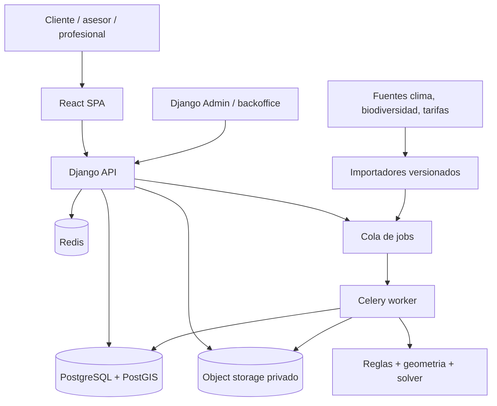
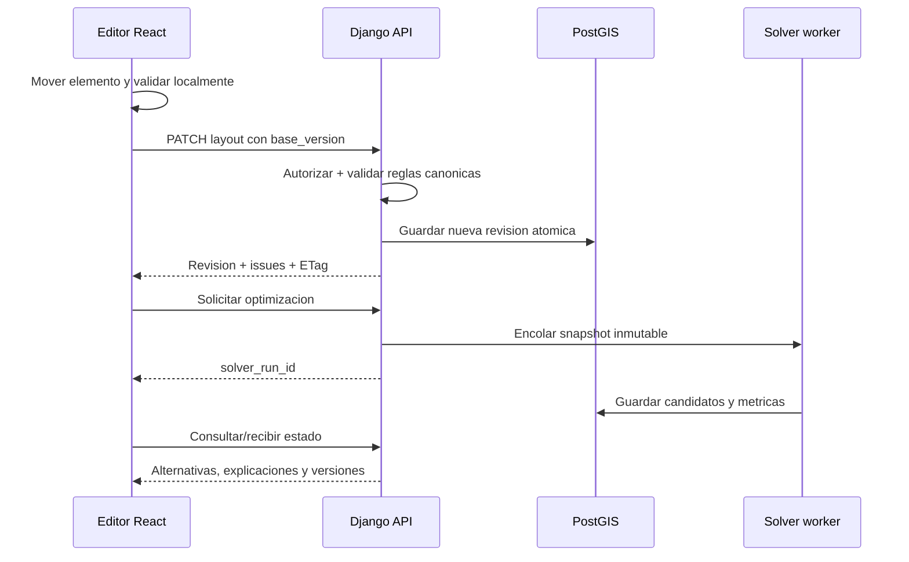

# 04. Arquitectura y stack tecnologico

## Recomendacion

Construir un **monolito modular con workers**, manteniendo un unico repositorio y una unica base de datos transaccional.



El motor de dominio debe vivir en paquetes Python independientes de HTTP y Django. Asi puede probarse en aislamiento, ejecutarse desde un worker y eventualmente extraerse sin reescribir las reglas.

## Evaluacion del stack actual

| Capa actual | Decision | Cambio propuesto |
|---|---|---|
| React 18 + TypeScript | Mantener | Migracion estricta completada en la base actual |
| Vite | Mantener | No migrar a Next.js sin necesidad de SSR |
| CSS unico | Evolucionar | Tokens, componentes base y estilos por dominio |
| Flask | Reemplazar de forma incremental | Django + DRF/GeoDjango |
| SQLAlchemy manual | Reemplazar en app nueva | Django ORM y migraciones |
| PostgreSQL | Mantener | Activar PostGIS y backups administrados |
| Redis | Mantener | Cache, jobs, locks y rate limit; nunca source of truth |
| Gunicorn | Mantener concepto | Gunicorn/ASGI segun necesidades reales |
| Docker Compose | Mantener local | Imagenes de produccion separadas y servicios administrados |
| Init SQL | Retirar gradualmente | Migraciones idempotentes y seed commands |

## Por que React + TypeScript + Vite

El centro del producto es un editor de alta interaccion, no contenido indexable. Vite permite conservar la base existente, ciclos rapidos y despliegue estatico. TypeScript agrega seguridad en operaciones geometricas, estados del editor y contratos API.

TypeScript no sustituye a Django. TypeScript pertenece al frontend React y tambien podria usarse para otros clientes. Django pertenece al backend Python: concentra autenticacion, permisos, organizaciones, migraciones, administracion y geometria persistente. El limite es HTTP/OpenAPI, no el lenguaje.

No se recomienda migrar ahora a Next.js porque:

- no resuelve geometria, roles ni persistencia
- introduce rendering y convenciones que el editor no necesita
- el sitio comercial con SEO puede ser un proyecto separado o agregarse despues
- una migracion simultanea de frontend y backend aumenta riesgo sin mejorar el piloto

Librerias sugeridas, incorporadas solo cuando aparece su necesidad:

| Necesidad | Opcion | Criterio |
|---|---|---|
| Routing | React Router | Flujos y URLs estables |
| Server state | TanStack Query | Cache, reintentos e invalidacion de API |
| Estado del editor | Zustand | Operaciones locales, historial y seleccion |
| Formularios | React Hook Form + Zod | Validacion y tipos compartibles |
| Canvas 2D | React Konva | Drag, capas, transformaciones y cientos de objetos |
| Geometria GeoJSON cliente | Turf por funcion | Solo operaciones necesarias; evitar paquete completo |
| Side-panel drag | dnd-kit | Accesible para listas; no reemplaza el canvas |
| Testing | Vitest + Testing Library + Playwright | Unidad, componentes y recorridos reales |

React Konva usa canvas, por lo que el editor debe ofrecer un arbol/lista semantica equivalente y controles por teclado. Para el primer prototipo tambien es valido SVG; el cambio a canvas debe ocurrir cuando complejidad o rendimiento lo justifiquen, no antes.

MapLibre se reserva para ubicar el predio sobre un mapa. El plano de jardin debe usar coordenadas locales metricas; no debe depender de un mapa web ni de latitud/longitud durante cada movimiento.

## Por que Django y no continuar solo con Flask

Flask es suficiente para los tres endpoints actuales. El producto objetivo, sin embargo, requiere:

- usuarios, sesiones y recuperacion
- organizaciones, grupos y permisos
- administracion interna del catalogo
- modelos relacionales y migraciones frecuentes
- formularios y validacion de backoffice
- auditoria y aprobaciones
- geometria mediante GeoDjango/PostGIS
- protecciones CSRF y configuracion de seguridad integrada

Django entrega una base coherente para estos problemas. Django REST Framework agrega serializacion, permisos, paginacion y contratos API. La migracion es mas barata ahora que despues de multiplicar endpoints Flask.

### Por que no FastAPI como framework principal

FastAPI es excelente para APIs tipadas y podria servir en un servicio de solver futuro. Para esta plataforma obligaria a ensamblar y mantener por separado administracion, autenticacion, permisos, sesiones y muchos flujos CRUD. El beneficio de tipado HTTP no compensa ese costo en el sistema principal.

### Estrategia de migracion sin big bang

1. Extraer `landscape.py` e `irrigation.py` a un paquete Python sin imports de framework.
2. Crear el proyecto Django al lado de Flask.
3. Implementar identidad, organizaciones, proyectos y catalogo en Django.
4. Exponer `/api/v1` y mantener temporalmente `/api/plan` en Flask.
5. Llamar al mismo paquete de dominio desde ambos durante la transicion.
6. Mover planificacion a jobs Django/Celery.
7. Cambiar el proxy del frontend y retirar Flask al completar pruebas de contrato.

No se comparte escritura sobre tablas sin una migracion y propietario claros.

## Estructura recomendada del monorepo

```text
apps/
  web/
    src/
      app/
      features/
        auth/
        projects/
        site-editor/
        catalog/
        layout-editor/
        irrigation/
        quotes/
        finance/
      components/
      design-system/
      api/
      test/
  api/
    config/
    modules/
      identity/
      organizations/
      clients/
      projects/
      sites/
      catalog/
      planning/
      irrigation/
      pricing/
      quotes/
      finance/
      collaboration/
      audit/
    manage.py
packages/
  planning_engine/
    geometry/
    constraints/
    scoring/
    solvers/
    explanations/
  irrigation_engine/
  contracts/
infra/
  docker/
  compose/
docs/
```

Los modulos Django pueden vivir como apps, pero deben mantener limites: finanzas no modifica geometria, el catalogo no conoce HTTP y planning no calcula precios directamente.

## Flujo de una edicion



## Concurrencia y versionado

- Cada layout tiene `current_revision`.
- El cliente envia `base_revision` o `If-Match`.
- Si otro usuario guardo antes, la API devuelve `409 Conflict` con operaciones divergentes.
- Un lock Redis corto puede indicar "alguien esta editando", pero la seguridad real es optimistic concurrency en PostgreSQL.
- Las versiones aprobadas son snapshots inmutables.
- Los jobs reciben IDs de snapshot, nunca leen "lo ultimo" a mitad de calculo.

## Contratos y validacion

- OpenAPI es el contrato publico de `/api/v1`.
- El frontend genera tipos desde OpenAPI; no duplica interfaces manualmente.
- Los DTO no exponen modelos ORM completos.
- Las unidades aparecen en nombres o tipos: `radius_m`, `flow_l_min`, `price_clp_per_m3`.
- Dinero usa decimal y moneda; nunca `float`.
- Fechas tarifarias usan zona y vigencia explicita.
- Errores siguen un formato estable con codigo, campo, mensaje y correlacion.

## Background jobs

Jobs apropiados:

- generar alternativas de layout
- recalcular riego masivo
- importar fuentes externas
- generar PDF y thumbnails
- analizar un plano cargado
- exportar datos
- purgar datos por retencion

Cada job debe ser idempotente, tener timeout, progreso, cancelacion, reintentos limitados y una dead-letter policy operacional. No se reintenta una entrada invalida.

## Infraestructura de produccion

Para el piloto:

- aplicacion web estatica en CDN
- API y worker en contenedores administrados
- PostgreSQL/PostGIS administrado con backups y point-in-time recovery cuando el plan lo permita
- Redis administrado o efimero segun proveedor
- bucket privado con versionado/lifecycle
- TLS administrado
- entornos separados: local, staging y production

No usar Kubernetes. No crear un cluster propio de Postgres. No publicar Postgres ni Redis a Internet. Un proveedor PaaS es suficiente mientras exista portabilidad mediante contenedores, migraciones y backups exportables.

## Stitch

Stitch debe tratarse como herramienta de diseno/prototipado, no como servicio requerido para planificar jardines. La aplicacion no debe fallar si Stitch no esta disponible, ni enviar su API key al navegador.

Acciones recomendadas:

- sacar `STITCH_API_KEY` del contenedor backend cuando no haya una integracion runtime real
- rotar la key que fue compartida durante el prototipado
- almacenar cualquier key futura en secret manager
- usar Stitch para explorar pantallas, estados y variantes; luego consolidar decisiones en el design system del repo

## Asistente AI

El asistente vive detras de Django y utiliza function/tool calling contra un dispatcher interno. La documentacion oficial de OpenAI recomienda Responses API para flujos con razonamiento, tools y multiples turnos, pero el contrato de tools debe ser independiente del proveedor.

```text
chat UI -> Django -> model gateway -> tool dispatcher -> policies -> domain services
```

Reglas de arquitectura:

- ninguna API key o tool privilegiada llega al navegador
- el modelo no recibe acceso SQL, shell, filesystem ni URLs arbitrarias
- el servidor construye contexto minimo desde objetos ya autorizados
- cada tool tiene schema cerrado, timeout, cuota, idempotencia y permiso
- las tools llaman los mismos servicios que la UI; no implementan una segunda logica
- lecturas pueden responder inmediatamente; escrituras producen command/draft
- cambios de layout, costos o alcance muestran diff y requieren confirmacion
- el modelo no puede aprobar excepciones tecnicas, cotizaciones ni gastos
- conversaciones y tool calls tienen retencion, exportacion, borrado y auditoria

MCP no es necesario para el chatbot embebido. Puede servir despues para exponer tools de forma estandar a integraciones autorizadas o conectar fuentes empresariales, siempre en servidor y con OAuth/scopes. El primer asistente debe usar functions internas: tienen menor superficie, permisos mas simples y contratos completamente controlados.

El model gateway debe permitir cambiar proveedor/modelo, configurar `store`/retencion, redactar PII, medir tokens/costo y ejecutar evals sin acoplar el dominio al SDK.

## Calidad y automatizacion

Un `Makefile` es la interfaz comun para personas y CI. No contiene logica compleja: delega a herramientas declaradas.

| Capa | Formato | Lint | Tipos | Tests |
|---|---|---|---|---|
| Python | Ruff format | Ruff check | MyPy | pytest + coverage |
| React/TypeScript | Prettier | ESLint | `tsc --noEmit` | Vitest/Testing Library; Playwright E2E |
| Infra | Compose config | Hadolint/Trivy en una ola posterior | N/A | Docker build + health smoke |

Ruff reemplaza Flake8, Black e isort para evitar configuraciones duplicadas. GitHub Actions ejecuta `make backend-check`, `make frontend-check` y `docker compose build`; `make check` reproduce el conjunto completo localmente.

## Decisiones que evitamos deliberadamente

- microservicios antes de encontrar limites operacionales reales
- GraphQL para CRUD y jobs sencillos
- JWT en `localStorage`
- MongoDB para geometria o catalogo relacional
- Redis como cola y base permanente a la vez
- una funcion serverless por endpoint
- IA generativa como juez de restricciones duras
- desplegar el servidor de desarrollo Vite en produccion
