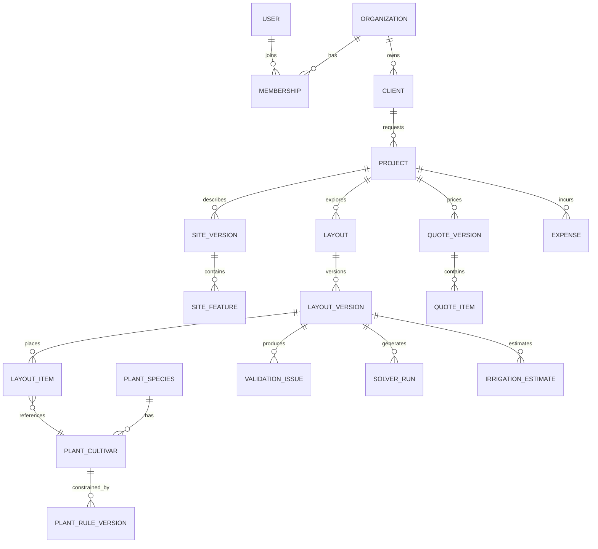

# 05. Modelo de datos y estrategia de conocimiento

## Principios

1. PostgreSQL es la fuente de verdad; Redis solo acelera.
2. La geometria, las reglas, las tarifas y los precios se versionan.
3. Un dato sin procedencia o fecha no puede sostener una afirmacion fuerte.
4. Taxonomia botanica, recomendacion horticultural y producto comercial son conceptos distintos.
5. Los snapshots aprobados no cambian cuando cambia el catalogo.
6. La base debe representar rangos, incertidumbre y excepciones, no solo valores unicos.

## Dominios de datos



## Identidad, organizaciones y clientes

### `users`

- UUID aleatorio
- email normalizado y verificado
- nombre visible
- estado y ultimo acceso
- preferencias de idioma/unidades
- no guardar rol global salvo operador de plataforma

### `organizations`

- razon/nombre comercial
- moneda, zona horaria y configuracion
- plan/estado de cuenta futuro
- politica de retencion

### `memberships`

- usuario, organizacion y rol
- estado de invitacion
- permisos adicionales/restricciones
- fechas de alta, baja y ultimo cambio

### `clients`

Una persona o empresa atendida por una organizacion. Separar del usuario autenticado: muchos clientes nunca tendran cuenta.

- contacto minimo necesario
- preferencias de contacto y consentimiento
- direccion de facturacion separada del sitio
- notas sensibles con acceso restringido

## Proyectos y sitio

### `projects`

- organizacion, cliente y responsables
- estado comercial/tecnico
- nivel de salida objetivo L0/L1/L2
- moneda e impuestos configurados
- presupuesto objetivo como rango
- fechas y tags

### `sites`

Contenedor estable para la propiedad. La direccion exacta debe ser opcional y protegida.

- comuna, region, pais
- punto aproximado o exacto con precision declarada
- zona horaria
- proveedor de agua inferido/confirmado

### `site_versions`

Snapshot de levantamiento:

- numero de revision
- metodo: informado, dibujado, plano calibrado, visita profesional
- escala, orientacion y precision
- geometria limite local
- georreferencia opcional
- autor, fecha y aprobacion

### `site_features`

- tipo y subtipo
- geometria local: punto, linea o poligono
- altura/profundidad cuando importa
- plantable, transitable, removible
- fuente y confianza
- metadata validada por tipo

Para un patio pequeno, usar un sistema cartesiano local en metros relativo a un origen del sitio. Guardar opcionalmente una transformacion a WGS84. PostGIS puede almacenar geometria local con SRID no definido por convencion documentada, y un campo separado `location` en SRID 4326 para clima y servicio. No mezclar grados con metros.

## Catalogo horticultural

### `plant_species`

Identidad botanica relativamente estable:

- nombre cientifico aceptado
- familia, genero y especie
- nombres comunes localizados
- origen para Chile: nativa, endemica, exotica, indeterminada
- estado de conservacion
- estado invasor/restringido
- IDs de fuentes oficiales

### `plant_cultivars`

La seleccion comercial o cultivar puede variar mucho en tamano y comportamiento:

- nombre cultivar
- especie base
- habito y forma
- rango maduro de alto y diametro de copa
- rango de raiz/proteccion cuando exista evidencia
- velocidad de crecimiento
- vida util aproximada como rango

### `plant_rule_versions`

No colocar todas las caracteristicas como columnas eternas. Versionar reglas por contexto:

- sol y tolerancia de sombra
- temperatura/heladas
- suelo, pH, drenaje y salinidad
- viento/costa
- agua mediante coeficiente/rango, no solo litros fijos
- distancia a estructura, tuberia, pavimento y otra especie
- toxicidad, espinas, alergenos, inflamabilidad
- mantenimiento
- restricciones regionales
- fecha de vigencia, fuente, revisor y confianza

Una regla contiene:

```text
subject + context + metric/operator/value/range + severity
+ source + valid_from/to + reviewer + confidence
```

Ejemplo: un radio de copa no es automaticamente una distancia de raices ni una prohibicion absoluta. Modelar `canopy_radius_m`, `recommended_spacing_m`, `root_caution_radius_m` y `structure_clearance_m` por separado.

### `region_suitability`

- especie/cultivar
- zona climatica o poligono
- aptitud y motivo
- periodo/estacion
- evidencia y revision

### Productos y proveedores

`supplier_products` representa lo comprable:

- proveedor, SKU y cultivar
- formato/contenedor y tamano al despacho
- precio, moneda, IVA y vigencia
- disponibilidad y lead time
- sustituciones permitidas

No sobrescribir el costo historico cuando cambia el proveedor; crear una nueva version.

## Layouts y validacion

### `layouts`

Agrupa una alternativa: "bajo riego", "mas sombra", "presupuesto objetivo".

### `layout_versions`

Snapshot inmutable o borrador revisable:

- site_version exacta
- rule_set_version
- objetivos y pesos
- autor: usuario o solver
- revision padre
- estado: draft, review, approved, superseded
- resumen y hash canonico

### `layout_items`

- UUID estable por objeto durante ediciones
- referencia a cultivar/producto o elemento generico
- geometria/centro, rotacion y escala
- etapa: instalacion, establecimiento, maduro
- cantidad/agrupacion cuando corresponda
- lock y origen de decision
- propiedades sobrescritas con motivo

### `validation_issues`

- codigo estable
- severidad: info, warning, blocking
- regla y version
- objetos involucrados
- geometria del conflicto
- mensaje localizado y datos para explicacion
- estado: open, resolved, accepted_exception
- actor, motivo y permiso de excepcion

No guardar solo texto. El codigo y los objetos permiten redibujar el anillo rojo, medir el solapamiento y traducir el mensaje.

### `solver_runs` y `solver_candidates`

- input snapshot/hash
- algoritmo y version
- seed aleatoria
- parametros, timeout y recursos
- status y motivo
- score descompuesto
- candidatos y explicaciones
- logs tecnicos sin PII

La seed y las versiones permiten reproducir una propuesta.

## Riego y tarifas

### `climate_stations` y `climate_observations`

- proveedor/fuente
- ubicacion y elevacion
- variable, unidad, fecha y calidad
- fecha de ingestion y licencia

No es necesario copiar toda la historia climatica inicialmente. Se pueden guardar agregados mensuales y referencias de fuente necesarias para reproducir la estimacion.

### `irrigation_zones`

- layout version
- geometria
- estrategia/emisor
- caudal objetivo
- eficiencia asumida
- restricciones de simultaneidad
- estado conceptual/tecnico

### `irrigation_estimates`

- periodo y escenario climatico
- ETo, K y area
- lluvia efectiva
- eficiencia
- demanda neta y bruta
- rango bajo/base/alto
- fuente y confianza

### `water_providers`, `service_areas`, `tariff_versions`

Una tarifa versionada debe poder expresar:

- proveedor y area de servicio
- fuente oficial y fecha de revision
- vigencia desde/hasta
- cargo fijo
- cargo variable de agua potable
- periodo punta/no punta
- umbral y cargo de sobreconsumo
- recoleccion de aguas servidas
- tratamiento/disposicion
- impuestos o reajustes aplicables
- unidad y reglas de redondeo

El costo de riego debe mostrar dos cifras cuando corresponde:

- **incremental atribuible al jardin**: volumen adicional por cargos variables pertinentes
- **boleta proyectada**: incluye cargos fijos y otros componentes, si se conoce el consumo base del hogar

## Cotizacion, presupuesto y gastos

### `price_books` y `price_items`

Catalogos internos versionados para plantas, materiales, equipos, horas, transporte, disposicion y subcontratos.

### `quote_versions` y `quote_items`

- alcance y layout aprobado
- cantidad, unidad y merma
- costo unitario y fuente
- precio unitario
- impuesto, descuento y margen
- opcional/protegido
- validez y condiciones

### `project_budgets`

- baseline aprobado
- forecast actual
- contingencia disponible/usada
- comprometido y real
- version y aprobacion

### `expenses`

- proyecto y categoria
- proveedor
- monto neto, impuesto, total, moneda
- fecha de gasto/documento
- estado: draft, submitted, approved, paid, rejected
- evidencia privada
- centro de costo y responsable
- referencia a partida presupuestaria

Esta no es una contabilidad oficial. Debe exportar y conciliar con el sistema contable, no intentar reemplazarlo durante el MVP.

## Auditoria y procedencia

### `audit_events`

- organizacion, actor y request ID
- accion y objeto
- timestamp y origen
- before/after reducido o patch
- motivo para operaciones sensibles

No guardar secretos, sesiones, archivos completos ni PII innecesaria en auditoria.

### `data_sources` y `review_records`

Toda fuente externa o decision experta registra:

- propietario y URL/identificador
- licencia/condicion de uso
- metodo de importacion
- fecha de captura y checksum
- campos derivados
- responsable y fecha de revision

## Indices y particion

Indices iniciales:

- todas las foreign keys
- `organization_id` primero en accesos multi-tenant frecuentes
- GiST para ubicaciones/areas geograficas donde se consulten intersecciones
- `(project_id, status, updated_at)` para operacion
- `(plant_species_id, valid_from)` para reglas
- `(provider_id, effective_from, effective_to)` para tarifas
- indices parciales para borradores/activos

No particionar tablas al inicio. Considerarlo para `audit_events`, observaciones climaticas o telemetria solo cuando volumen y consultas lo demuestren.

## Cache

Una clave de resultado debe incluir:

```text
site_version + layout/input hash + rule_set_version
+ climate_version + tariff_version + engine_version
```

TTL no corrige invalidacion incorrecta. Los resultados aprobados viven en PostgreSQL; Redis solo conserva calculos repetibles y efimeros.

## Migracion desde la tabla actual

1. Crear modelos nuevos sin eliminar `plants`.
2. Importar cada fila como especie/cultivar provisional.
3. Marcar valores actuales como `prototype_unverified`.
4. Separar radios, agua y estilo en reglas versionadas.
5. Revisar las ocho especies con un experto y fuentes.
6. Cambiar `/api/plants` a una vista de compatibilidad.
7. Retirar tabla/seed antigua solo despues de comparar resultados y backups.

Los valores actuales no deben entrar a produccion como hechos horticulturales validados.
