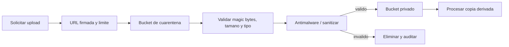

# 07. Seguridad, privacidad y confiabilidad

## Postura de riesgo

Un plano de una vivienda, su direccion, fotos, accesos, presupuesto y datos de contacto forman un conjunto sensible aunque la aplicacion no procese salud o banca. El mayor riesgo no es un algoritmo incorrecto aislado: es que un usuario vea el proyecto de otra organizacion o que un archivo/plan privado quede publico.

El piloto debe tratar seguridad como requisito P0, no como endurecimiento posterior.

## Clasificacion de datos

| Clase | Ejemplos | Tratamiento |
|---|---|---|
| Publico | Catalogo publicado, contenido de marketing | CDN y cache publica permitidos |
| Interno | Reglas en revision, metricas agregadas | Solo staff/organizacion segun caso |
| Confidencial | Contacto, presupuesto, cotizacion, costos | Acceso por rol, cifrado y auditoria |
| Altamente sensible | Direccion exacta, plano, fotos, accesos, secretos | Minimizacion, almacenamiento privado y logs restringidos |

Los logs y herramientas de analitica heredan la sensibilidad del dato que reciben. No son una excepcion.

## Amenazas prioritarias

| Amenaza | Ejemplo | Control principal |
|---|---|---|
| IDOR / fuga entre tenants | Cambiar UUID para abrir otro proyecto | Tenant scoping server-side y pruebas de autorizacion por objeto |
| Robo de sesion | Token en localStorage filtrado por XSS | Cookie HttpOnly/Secure/SameSite, CSP, rotacion y timeout |
| CSRF | Sitio externo ejecuta cambios | CSRF middleware/token y same-origin |
| Escalada de privilegios | Cliente aprueba excepcion tecnica | Permisos centralizados y matriz deny-by-default |
| Archivo malicioso | PDF/imagen con payload o polyglot | Allowlist, limites, inspeccion, scan, bucket privado |
| DoS del solver | Miles de plantas/vertices/jobs | Cuotas, schema limits, timeout, cancelacion y cola |
| Manipulacion financiera | Cambiar costo o margen sin rastro | Aprobaciones, decimal, snapshots y auditoria |
| Dato externo comprometido | Tarifa o regla importada incorrecta | Staging, checksum, diff y revision humana |
| Secret leakage | API key en repo, imagen o log | Secret manager, escaneo y rotacion |
| Ransomware/borrado | Cuenta admin o despliegue comprometido | Backups aislados, MFA, minimo privilegio y restore drills |

## Autenticacion y sesiones

### Recomendacion inicial

- Django session authentication bajo el mismo dominio que el frontend
- cookies `HttpOnly`, `Secure` y `SameSite=Lax` o mas estricto segun flujo
- CSRF activo para toda operacion insegura
- HTTPS en todo el sitio
- email verificado
- Argon2id para passwords si se gestionan localmente
- MFA obligatorio para administradores, finanzas y roles con exportacion masiva
- regenerar sesion al autenticar o cambiar privilegios
- invalidar sesiones en cambio de password, baja o sospecha
- rate limit y demora progresiva en login/recuperacion

No almacenar access/refresh tokens en `localStorage`. Si mas adelante existe app movil o API de terceros, usar OAuth/OIDC con scopes y un proveedor probado; no inventar un protocolo.

### Invitaciones y enlaces de cliente

- token aleatorio, hash almacenado y expiracion corta
- uso unico o revocable
- permiso limitado a proyecto y acciones explicitas
- no incluir PII ni permisos en el token legible
- exigir reautenticacion para aprobaciones o descargas sensibles

## Autorizacion

Tres capas obligatorias:

1. permiso por rol dentro de organizacion
2. alcance por objeto/proyecto
3. regla contextual, por ejemplo estado aprobado o monto

Patron de consulta:

```text
request.user
  -> membership activa en organization
  -> queryset filtrado por organization
  -> object permission
  -> transition/approval policy
```

La organizacion nunca se acepta solo desde un header o body sin verificar membresia. UUIDs no sustituyen autorizacion.

Pruebas negativas obligatorias: cada endpoint sensible se prueba con otro usuario, otro proyecto y otra organizacion.

## Seguridad de API

- version `/api/v1`
- schemas estrictos; rechazar campos desconocidos en operaciones sensibles
- rangos de coordenadas, areas, cantidades y montos
- limite de body, vertices, items y profundidad JSON
- paginacion con maximo
- error generico al cliente y correlacion para soporte
- CORS limitado a origen real; en same-origin puede desactivarse
- rate limit por usuario, organizacion, IP y operacion costosa
- idempotency key para crear jobs, pagos futuros o importaciones
- timeouts de entrada, DB y servicios externos
- sin detalles de Postgres/Redis/secretos en health publico

## Uploads y documentos

Flujo recomendado:



Controles:

- allowlist inicial: PDF, PNG, JPEG y formatos definidos
- verificar contenido real, no solo extension/MIME enviado
- nombre generado por servidor
- limite de paginas, pixeles, compresion y tamano
- bloquear SVG/HTML y ejecutables al inicio
- no servir uploads desde el dominio de la aplicacion como contenido inline no confiable
- URLs firmadas con expiracion
- thumbnails y PDFs derivados generados en sandbox/worker
- metadata EXIF sensible eliminada de copias visibles cuando no sea necesaria
- politica de borrado de originales

## Secretos y supply chain

- `.env` solo para desarrollo y siempre ignorado
- produccion usa variables cifradas/secret manager del proveedor
- permisos por servicio; worker no recibe secretos que no usa
- rotacion documentada y al menos ante exposicion, baja de personal o incidente
- escaneo de secretos pre-commit y CI
- dependencias bloqueadas con lockfiles
- actualizaciones automatizadas con tests
- SCA, SAST y analisis de imagen de contenedor en CI
- imagenes base minimas, usuario no root y filesystem read-only cuando sea posible
- generar SBOM en releases relevantes

La API key de Stitch compartida durante el prototipado debe considerarse expuesta y rotarse. Como el backend no usa Stitch para ejecutar el producto, no debe recibir esa key en produccion.

## Privacidad en Chile

La Ley 21.719 entra en vigencia el **1 de diciembre de 2026** segun la Biblioteca del Congreso Nacional. El producto debe diseñarse desde ahora para el nuevo regimen, con revision legal antes de abrirlo a publico. Este documento no reemplaza asesoria juridica.

Capacidades de producto necesarias:

- inventario de finalidades y bases de tratamiento
- aviso de privacidad claro al capturar datos
- consentimiento separado cuando sea la base aplicable
- minimizacion: ubicacion aproximada hasta necesitar direccion exacta
- exportacion de datos del titular
- rectificacion y eliminacion/anominizacion segun obligaciones
- retencion configurable y jobs de purga
- registro de proveedores/subencargados
- proceso de incidentes y notificacion
- privacy by default en proyectos y enlaces
- evaluacion de impacto para usos futuros de IA, imagenes o geolocalizacion masiva

No usar planos, fotos, comentarios o proyectos para entrenar modelos sin una finalidad y autorizacion separadas. La telemetria debe ser agregada/pseudonimizada.

## GDPR y asistente AI

Si el servicio se ofrece a personas en la Union Europea o cae dentro del alcance territorial del GDPR, se aplican como minimo limitacion de finalidad, minimizacion, exactitud, limitacion de conservacion, seguridad y accountability. La privacidad por diseño y por defecto debe incorporarse antes de lanzar, no solo en una politica legal.

Controles de producto:

- definir controller/processor y contratos de subprocesadores antes de enviar datos a un modelo
- enviar solo el fragmento de proyecto necesario para la accion actual
- seudonimizar identificadores y excluir direccion/fotos salvo necesidad explicita
- configurar retencion del proveedor y no reutilizacion para training cuando el contrato lo requiera
- separar consentimiento de mejora del producto de la prestacion principal
- permitir acceso, exportacion, rectificacion, borrado y restriccion segun aplique
- definir residencia/transferencias internacionales y mecanismo legal aplicable
- ejecutar DPIA si el riesgo, escala, geolocalizacion o monitoreo lo exige
- no tomar decisiones legales/comerciales significativas exclusivamente por el modelo
- informar cuando el usuario conversa con AI, sus limites y como pedir revision humana

Seguridad de tools:

- prompt y texto del usuario son datos no confiables, nunca instrucciones de sistema
- allowlist por rol, proyecto, estado y turno
- outputs de tools se validan antes de volver al modelo
- URLs, archivos y contenido externo se tratan como potencial prompt injection
- no encadenar tools de escritura sin aprobacion cuando aumenta impacto
- presupuesto maximo de llamadas y circuito de corte por conversacion
- request/tool IDs en auditoria, con argumentos sensibles redactados
- evals adversariales antes de publicar cada nuevo tool

## Cifrado y datos

- TLS en transito
- cifrado de volumen/bucket/backup administrado
- secretos fuera de DB
- campos especialmente sensibles pueden requerir cifrado de aplicacion si el threat model lo justifica
- claves separadas por entorno
- backups cifrados y acceso limitado
- borrado logico para operacion, seguido de purga segun politica

El cifrado no corrige una consulta sin tenant filter. Autorizacion y minimizacion siguen siendo controles principales.

## Auditoria

Registrar:

- login, logout, fallos y MFA
- invitaciones y cambios de membresia/rol
- lectura/exportacion masiva sensible
- cambios y aprobaciones de layout, reglas, tarifas, precios y presupuestos
- excepciones a restricciones
- descargas de planos y documentos cuando sea proporcionado
- operaciones administrativas y borrados

Cada evento incluye actor, organizacion, objeto, accion, tiempo, resultado, request ID y motivo cuando aplica. Los logs de auditoria son append-only para la aplicacion y tienen retencion definida.

## Confiabilidad y recuperacion

### Entornos

- local con datos sinteticos
- staging sin datos reales salvo proceso controlado
- production aislado, sin acceso directo cotidiano

### Backups

- backup automatico de PostgreSQL
- versionado/lifecycle del bucket
- copia fuera del mismo fallo administrativo cuando el negocio lo justifique
- prueba de restauracion trimestral en piloto y mas frecuente al escalar
- documentar RPO/RTO y medir el restore real

Un backup nunca probado es una esperanza, no un control.

### Despliegues

- migraciones backward-compatible
- backup/check antes de migraciones de alto riesgo
- health/readiness internos
- rolling/blue-green segun plataforma
- feature flags para cambios riesgosos
- rollback de codigo; para datos usar migraciones forward correctivas

## Observabilidad

- logs JSON con request/job ID, sin secretos/PII
- metricas: latencia, errores, DB pool, cache, cola, tiempo de solver, fallos de importacion
- traces para API -> job -> DB en recorridos costosos
- alertas por sintomas del usuario, no solo CPU
- dashboard de fuentes desactualizadas y jobs muertos
- error tracking con redaccion de payloads

SLO iniciales estan en [alcance funcional](03-functional-scope-and-requirements.md). Cada SLO debe tener owner y respuesta; medir sin reaccion no agrega confiabilidad.

## Secure development lifecycle

### En cada PR

- lint/typecheck/tests
- migraciones revisadas
- pruebas de permisos si toca datos
- escaneo de dependencias/secretos
- cambios de API documentados

### Antes de piloto

- threat modeling actualizado
- `manage.py check --deploy`
- prueba de aislamiento multi-tenant
- prueba de uploads maliciosos y limites
- restore drill
- rotacion de secretos del prototipo
- revision de headers, cookies, CSP, CORS y TLS
- dependencia y container scan sin hallazgos criticos abiertos

### Antes de L2 o pagos

- pentest independiente proporcional al riesgo
- revision legal/privacidad
- proceso de incidentes ensayado
- doble aprobacion en operaciones financieras sensibles
- pruebas de integridad de documentos y cotizaciones
