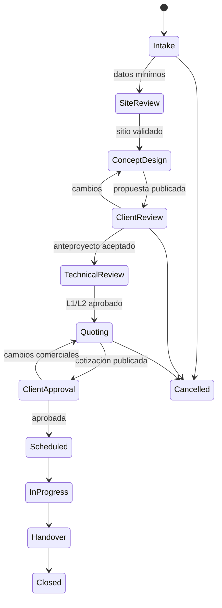

# 08. Roles, permisos y gobierno

## Modelo de acceso

Los roles viven en una membresia de organizacion. Un cliente externo puede tener acceso adicional a proyectos concretos. El sistema debe permitir permisos finos sin convertir cada usuario en una combinacion manual imposible de auditar.

## Roles recomendados

### Visitante

- prueba demo con datos no persistentes o proyecto anonimo limitado
- no ve proyectos reales
- puede iniciar registro

### Cliente

- ve proyectos compartidos con el
- completa intake y comentarios
- mueve elementos solo si la version/flujo lo permite
- compara alternativas publicadas
- aprueba hitos comerciales definidos
- no ve costos internos, margen, reglas en borrador ni otros clientes

### Asesor comercial

- crea clientes y proyectos
- facilita intake y genera antepropuestas
- prepara cotizaciones desde price books aprobados
- comparte y solicita aprobacion
- no publica reglas horticulturales ni altera gastos aprobados

### Diseñador/paisajista

- edita sitio, layout, restricciones blandas y alternativas
- ejecuta solver y crea excepciones tecnicas segun nivel
- aprueba L1 si la organizacion lo autoriza
- no cambia tarifas o costos internos sin rol adicional

### Especialista tecnico/riego

- revisa condiciones, hidrozonas y componentes
- valida datos L2 y aprueba plan tecnico
- bloquea elementos tecnicos
- documenta excepciones y pendientes

### Tecnico de terreno

- accede a proyectos asignados y checklist movil
- carga medidas, fotos y evidencias
- marca cantidades/estado de ejecucion
- no ve margen global ni edita versiones aprobadas

### Gestor de catalogo/horticultor

- crea y revisa especies, cultivares, reglas y fuentes
- publica versiones tras workflow
- puede retirar una recomendacion y marcar proyectos afectados
- no aprueba gastos ni cotizaciones

### Finanzas/compras

- mantiene price books, proveedores y gastos
- aprueba presupuestos y variaciones segun umbral
- ve costos/margenes autorizados
- propone sustituciones economicas, pero no puede alterar restricciones protegidas

### Administrador de organizacion

- gestiona membresias, configuracion y politicas
- puede ver auditoria y exportaciones de su organizacion
- no puede borrar silenciosamente auditoria ni publicar conocimiento tecnico sin el rol correspondiente

### Operador de plataforma

- opera infraestructura y soporte controlado
- acceso a contenido de cliente solo mediante flujo break-glass, motivo, tiempo limitado y auditoria
- no pertenece implicitamente a todas las organizaciones

### Auditor

- lectura de cambios, versiones, aprobaciones y finanzas dentro de alcance
- sin permisos de edicion

## Matriz resumida

| Accion | Cliente | Asesor | Diseñador | Tecnico | Catalogo | Finanzas | Admin |
|---|---:|---:|---:|---:|---:|---:|---:|
| Ver proyecto compartido | Si | Si | Si | Asignado | No | Si | Si |
| Editar intake | Limitado | Si | Si | Medidas | No | No | Si |
| Editar layout draft | Opcional | Si | Si | No | No | No | Si |
| Aceptar warning | No | Configurable | Si | Si | No | No | Configurable |
| Aprobar L1 | No | Configurable | Si | No | No | No | Configurable |
| Aprobar L2 | No | No | Configurable | Especialista | No | No | No |
| Publicar regla | No | No | No | No | Si, con review | No | No |
| Ver costo/margen | No | Parcial | Opcional | No | No | Si | Si |
| Aprobar variacion | No | Bajo umbral | No | No | No | Si | Configurable |
| Gestionar miembros | No | No | No | No | No | No | Si |
| Ver auditoria | Propia | Parcial | Parcial | Propia | Catalogo | Finanzas | Si |

Los permisos finales se expresan como policies testeables. La tabla es un punto de partida, no la implementacion.

## Estados del proyecto

Una transicion registra actor, fecha, version de artefactos, checklist y motivo. No basta actualizar un string `status`.

## Workflow de catalogo y reglas

1. `draft`: captura o importacion inicial.
2. `in_review`: fuente y campos completos.
3. `approved`: segundo rol o experto valida.
4. `published`: disponible para nuevos calculos.
5. `deprecated`: no se ofrece, pero conserva historia.
6. `withdrawn`: riesgo; generar alerta para proyectos afectados.

La misma persona no deberia publicar cambios de alto impacto que creo, especialmente especies restringidas, distancias de seguridad o formulas de costo.

## Workflow tarifario

1. Importar a staging con archivo/fuente.
2. Validar unidades, vigencia y componentes.
3. Mostrar diff contra vigente.
4. Finanzas/revisor aprueba.
5. Activar desde fecha efectiva.
6. Marcar borradores para recalculo; no reescribir cotizaciones aprobadas.

## Workflow de excepciones

Una excepcion registra:

- regla y objetos
- valor requerido y observado
- motivo y mitigacion
- actor y rol
- alcance: solo esta version
- fecha de expiracion/revision si aplica

Restricciones de legalidad, seguridad conocida o falta de datos L2 no deben poder convertirse en warning por un usuario comercial.

## Separacion de responsabilidades

| Conflicto | Separacion recomendada |
|---|---|
| Crear proveedor y aprobar pago | Dos acciones/roles distintos sobre umbral |
| Editar price book y aprobar cotizacion | Review para cambios de margen relevantes |
| Crear regla y publicarla | Autor + revisor |
| Solicitar excepcion y aprobar L2 | Profesional distinto o doble confirmacion |
| Administrar usuarios y borrar auditoria | Auditoria no borrable desde UI normal |

En equipos pequeños una persona puede tener varios roles, pero cada accion conserva el rol/policy usado y puede requerir reautenticacion.

## Gobierno de producto y datos

Owners recomendados:

| Area | Owner | Decide |
|---|---|---|
| Experiencia y alcance | Product owner | Prioridad y criterios de exito |
| Reglas de paisajismo | Landscape lead | Validez y excepciones horticulturales |
| Riego | Irrigation specialist | Formula, supuestos y nivel L2 |
| Catalogo | Data steward/horticultor | Calidad, fuentes y vigencia |
| Tarifas/precios | Finanzas/compras | Fuente, activacion y margen |
| Seguridad/privacidad | Engineering owner + legal | Controles y tratamiento |
| Arquitectura | Tech lead | Limites y deuda aceptada |

## Registro de decisiones

Decisiones que cambian alcance, formula, riesgo o costo deben registrar:

- contexto y problema
- opciones consideradas
- decision y responsable
- fecha y evidencia
- consecuencias y fecha de revision

Usar ADRs tecnicos y decision records de producto. Evitar que decisiones importantes queden solo en chat o Figma.

## Soporte y break-glass

- soporte ve metadata por defecto, no contenido
- acceso excepcional requiere ticket/motivo
- privilegio temporal y minimo
- banner visible al operador
- evento de auditoria y notificacion interna
- revision posterior para accesos sensibles

No compartir passwords, tokens ni enlaces permanentes para "resolver rapido".
