# 09. Finance manager y control de costos

## Dos alcances diferentes

"Finance manager" significa dos cosas que deben coexistir:

1. un **rol humano** que administra precios, presupuesto, compras, gastos, aprobaciones y margen
2. un **modulo del producto** que conecta cantidades del plan con costo previsto, comprometido y real

El modulo no reemplaza contabilidad tributaria, bancos ni un ERP. Debe producir datos limpios y exportables, no recrear todos esos sistemas.

## Regla fundamental

La optimizacion financiera sigue esta jerarquia:

```text
1. legalidad y seguridad
2. requisitos tecnicos necesarios
3. alcance aprobado por cliente
4. calidad minima y mantenibilidad
5. costo total y margen
6. preferencias opcionales
```

Una reduccion de costo nunca puede saltarse los puntos superiores. Si el presupuesto no alcanza, el sistema presenta alternativas y un cambio de alcance; no degrada silenciosamente la solucion.

## Vocabulario financiero

| Concepto | Definicion |
|---|---|
| Estimacion | Aproximacion temprana con rango y supuestos |
| Presupuesto baseline | Costo/ingreso aprobado contra el que se mide variacion |
| Forecast | Mejor estimacion actual al cierre |
| Comprometido | Orden, contrato o reserva aun no pagada |
| Real | Gasto ocurrido y respaldado |
| Contingencia | Reserva explicita para incertidumbre definida |
| Costo directo | Planta, material, mano de obra o equipo atribuible |
| Overhead | Costo indirecto asignado por politica |
| Precio | Lo que se cobra al cliente |
| Margen bruto | Precio neto menos costo directo/definido |
| Variacion | Diferencia contra baseline en monto y porcentaje |

Guardar montos como decimal y moneda ISO. En CLP se puede mostrar sin decimales, pero no perder precision en tarifas `CLP/m3`, impuestos o conversiones.

## Ciclo financiero del proyecto

```mermaid
flowchart LR
    A[Layout aprobado] --> B[BOM y horas]
    B --> C[Costeo por price book]
    C --> D[Presupuesto y contingencia]
    D --> E[Cotizacion]
    E --> F[Aprobacion cliente]
    F --> G[Compromisos / compras]
    G --> H[Gastos reales]
    H --> I[Forecast y variacion]
    I --> J[Cierre y aprendizaje]
```



Cada flecha conserva la version de origen. Si cambia el layout, el sistema calcula delta de cantidades y requiere revision comercial cuando supera una regla configurable.

## De layout a BOM

El bill of materials debe incluir mas que plantas:

- plantas por cultivar, formato y cantidad
- sustrato, compost, mulch y mejoradores por area/volumen
- bordes, pavimentos y hardscape
- retiro y disposicion
- tuberias, fittings, valvulas, controladores, filtros y emisores
- horas por especialidad
- equipos y arriendos
- transporte y accesos
- merma
- inspecciones/subcontratos
- contingencias explicitamente justificadas

Las formulas de cantidad tienen version y unidad. Una cantidad manual conserva motivo y autor.

## Price book

Cada precio necesita:

- item/SKU y proveedor
- unidad de compra y unidad de uso
- costo neto, impuesto y moneda
- fecha de cotizacion y vigencia
- cantidad minima
- disponibilidad/lead time
- zona de entrega
- fuente/evidencia
- calidad/confianza

Nunca sobrescribir un precio historico. Las nuevas cotizaciones usan la version vigente; las aprobadas conservan su snapshot.

## Presupuesto protegido

Clasificar partidas:

| Clase | Puede reducirse automaticamente | Ejemplo |
|---|---:|---|
| Obligatoria tecnica | No | Valvula necesaria, distancia segura, preparacion de suelo minima |
| Compromiso cliente | No sin change request | Especie focal aprobada, superficie acordada |
| Equivalente sustituible | Solo con reglas/aprobacion | Vivero/formato o material funcionalmente equivalente |
| Optimizable | Si dentro de limites | Logistica, agrupacion de compras, secuencia |
| Opcional | Si, mostrando impacto | Iluminacion decorativa, segunda alternativa estetica |
| Contingencia | Solo por evento/aprobacion | Condicion de suelo desconocida |

Cada partida protegida debe indicar por que: seguridad, regulacion, requisito tecnico, contrato o preferencia bloqueada.

## Motor de optimizacion de costo

Antes de usar un solver, implementar reglas transparentes:

1. consolidar cantidades y evitar duplicados
2. comparar proveedores por costo total entregado, no precio unitario
3. respetar formato/calidad y disponibilidad
4. reducir viajes mediante agrupacion
5. reutilizar excedentes solo si trazables y aptos
6. proponer equivalentes horticulturales/tecnicos aprobados
7. mostrar costo de ciclo de vida: agua y mantenimiento
8. alertar partidas sin precio vigente o con baja confianza

Funcion objetivo posible:

```text
minimizar costo_total_entregado + riesgo_de_precio + costo_operacional
sujeto a alcance protegido, calidad, disponibilidad, plazo y restricciones tecnicas
```

El sistema devuelve alternativas, ahorro, supuestos e impacto. Finanzas propone; diseño/tecnico y cliente aprueban cuando el cambio toca su dominio.

## Gastos

Campos minimos:

- proyecto, categoria y partida
- proveedor
- fecha, numero de documento y evidencia
- monto neto, IVA/otro impuesto y total
- moneda y tipo de cambio si aplica
- metodo/estado de pago sin guardar credenciales
- solicitante, aprobador y beneficiario
- estado y comentarios

Validaciones:

- duplicado por proveedor/documento/monto/fecha
- monto positivo y moneda valida
- evidencia sobre umbral
- partida activa
- permiso y separacion de responsabilidades
- desviacion contra presupuesto
- proveedor bloqueado o no aprobado

## Aprobaciones

Umbrales son configurables por organizacion, no hardcoded. Ejemplo de politica:

- dentro de partida y bajo umbral: responsable de proyecto
- fuera de partida o sobre umbral: finanzas
- usa contingencia: finanzas + owner tecnico/comercial
- cambia alcance cliente: change request y nueva aceptacion
- cambia componente de seguridad: rechazo automatico hasta aprobacion tecnica

Las aprobaciones requieren comentario cuando hay variacion y reautenticacion para operaciones de alto impacto.

## Reportes operacionales

### Por proyecto

- ingreso cotizado/aprobado
- costo baseline, comprometido, real y forecast
- margen baseline y forecast
- contingencia disponible
- top variaciones con causa
- partidas sin precio/orden/evidencia
- agua/mantenimiento proyectado como costo de ciclo de vida

### Portafolio

- margen por tipo de proyecto
- precision de estimacion
- variacion por categoria/proveedor
- compras urgentes versus planificadas
- tasa de sustitucion y efecto
- tiempo desde aprobacion a compra
- desperdicio/merma

### Producto/tecnologia

- infraestructura por proyecto activo y propuesta generada
- minutos de solver y costo por job
- almacenamiento por proyecto
- servicios externos por usuario
- soporte y retrabajo por proyecto
- costo de adquisicion de datos

No optimizar infraestructura por porcentaje de CPU mientras el mayor costo sea retrabajo humano. Medir costo por resultado de negocio.

## Control del gasto de desarrollo

### Conservar

- stack open source existente
- un repo y monolito modular
- Docker local
- PaaS y bases administradas
- backoffice de Django antes de construir uno propio

### Comprar/usar servicio administrado

- email transaccional
- almacenamiento y backups
- error tracking/observabilidad basica
- antimalware o scanning si el costo de operarlo supera el servicio
- identidad externa solo si requisitos B2B/MFA justifican costo y lock-in

### Postergar

- Kubernetes
- microservicios
- render 3D/fotorrealista
- vision automatica de planos
- inventario universal en tiempo real
- data warehouse antes de tener volumen
- app movil nativa antes de validar captura offline

## Gates de inversion

| Inversion | Evidencia requerida |
|---|---|
| Solver avanzado | Heuristica falla en corpus real o consume demasiado tiempo humano |
| PostGIS complejo/georreferencia | Usuarios cargan predios irregulares y capas geograficas |
| IA de imagen | Volumen de planos y costo manual medidos |
| Integraciones con viveros | Conversion/compras limitadas por disponibilidad manual |
| App movil | Tecnicos realizan captura frecuente sin conectividad |
| Infra multi-region | SLA, usuarios y riesgo de region lo exigen |

## Control mensual del producto

El finance manager y product/engineering revisan:

1. gasto real versus presupuesto de desarrollo
2. costo unitario por proyecto/propuesta
3. servicios no usados y recursos sobredimensionados
4. deuda que genera retrabajo o riesgo
5. alcance nuevo y evidencia que lo justifica
6. forecast de 90 dias
7. riesgos que no deben recortarse

La seguridad, backups, calidad de datos y validaciones tecnicas son costo necesario. Se optimiza su implementacion, no se eliminan para mejorar una planilla de corto plazo.
