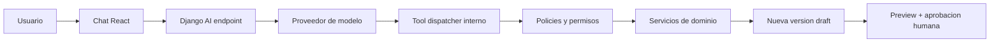

# 10. Roadmap, entrega y calidad

## Estado de ejecucion

Este roadmap se ejecuta desde el 15 de agosto de 2026. La prioridad inmediata no es agregar mas pantallas al prototipo, sino crear una base verificable sobre la que se pueda reemplazar el frontend visual y migrar el backend sin perder el comportamiento actual.

| Ola | Resultado | Estado |
|---|---|---|
| 0. Calidad reproducible | Makefile, TypeScript, lint, formato, tests y CI | Completada |
| 1. Contratos y dominio | API tipada, tests caracterizadores y errores estructurados | En ejecucion |
| 2. Backend de producto | Django, PostGIS, usuarios, organizaciones y proyectos | Pendiente |
| 3. Editor profesional | Flujo responsive listo; drag/drop, conflictos, undo y autosave pendientes | En prototipo |
| 4. Datos y planificacion | Catalogo versionado, reglas, solver y riego L1 | Pendiente |
| 5. Asistente AI | Conversacion con tools restringidas y aprobaciones | Pendiente |
| 6. Finanzas y piloto | BOM, cotizacion, gastos, privacidad y hardening | Pendiente |

## Ola 0: calidad reproducible

Objetivo: cualquier desarrollador y GitHub deben ejecutar exactamente los mismos controles con un comando.

### Entregables

- migrar todo `frontend/src` y configuracion Vite a TypeScript estricto
- separar tipos y cliente API del componente visual
- `Makefile` con `install`, `format`, `lint`, `typecheck`, `test`, `build` y `check`
- Ruff para formato/lint Python, reemplazando la combinacion Flake8 + Black + isort
- MyPy para tipos Python
- pytest + coverage para dominio/API
- ESLint + TypeScript + Prettier para frontend
- Vitest + Testing Library para componentes y funciones
- GitHub Actions para backend, frontend y build Docker
- Dependabot para dependencias Python, npm y Actions
- README con comandos y politica de calidad

### Gate de salida

- `make check` pasa localmente desde una instalacion limpia
- CI usa `npm ci` y dependencias Python declaradas
- no quedan archivos `.jsx` o `.js` de aplicacion/configuracion
- existen tests de planner, riego, cache, API y pantalla inicial
- formato y lint fallan el PR si hay errores
- Docker reconstruye y health check sigue sano

## Ola 1: contratos y dominio

Objetivo: encapsular lo que funciona hoy antes de reemplazar Flask.

### Entregables

- DTOs versionados para planta, sitio, layout, issue y estimacion
- validacion de payload con limites y errores por campo
- request IDs y logs JSON sin PII
- manejo explicito de DB/Redis caidos
- tests golden del planner actual
- paquete Python de dominio sin imports Flask/Django
- OpenAPI como contrato que genera tipos del frontend

### Gate de salida

- un mismo corpus produce resultados equivalentes desde Flask y el paquete de dominio
- errores esperables nunca aparecen como `500`
- fallos de cache no detienen planificacion
- payloads excesivos o geometrias invalidas se rechazan de forma controlada

## Ola 2: backend Django/PostGIS

Objetivo: agregar las responsabilidades de producto que Flask y TypeScript no resuelven.

TypeScript corre en React y protege el editor del navegador. Django corre en Python y resuelve API, autenticacion, permisos, organizaciones, administracion, migraciones y acceso a PostGIS. No son alternativas entre si.

### Entregables

- Django + DRF/GeoDjango bajo `/api/v1`
- sesion segura, CSRF, MFA para roles sensibles e invitaciones
- organizaciones, membresias, clientes y proyectos
- sitio/layout/versiones persistentes
- PostGIS y migraciones; retirar init SQL como mecanismo principal
- Django Admin para catalogo, fuentes y tarifas
- compatibilidad temporal con `/api/plan`

### Gate de salida

- pruebas negativas demuestran aislamiento entre organizaciones
- una version aprobada no puede mutarse
- Flask y Django comparten el engine durante la transicion
- el frontend cambia de API sin cambiar comportamiento visible

## Ola 3: experiencia y editor profesional

Objetivo: reemplazar la pantalla monolitica mostrada en la captura por un flujo que se pueda usar y entender.

### Entregables

- wizard de espacio, condiciones, preferencias y wishlist
- workspace separado para la propuesta, sin formulario largo permanente
- plano local metrico con capas, escala, zoom/pan y seleccion
- drag/drop con anillo de clearance y conflicto rojo translucido
- validacion local durante el gesto y canonica en servidor al soltar
- undo/redo, autosave, locks visuales y optimistic concurrency
- panel contextual, no tarjetas flotantes que tapan el plano
- responsive deliberado: intake/revision movil, editor desktop/tablet
- accesibilidad por teclado y lista semantica equivalente al canvas

### Gate de salida

- el mapa no se corta ni requiere una resolucion especifica
- una persona entiende donde esta, que debe hacer y por que existe un conflicto
- mover, deshacer, guardar y reabrir estan cubiertos por Playwright
- feedback de drag p95 menor a 100 ms con un layout de referencia

## Ola 4: datos, solver y riego

Corresponde a los hitos de catalogo y planificacion detallados mas abajo. El solver avanzado entra despues de validar reglas y corpus, no como requisito del editor.

## Ola 5: asistente AI con tools restringidas

Objetivo: permitir que el usuario exprese intenciones como "quiero mas sombra sin aumentar mucho el agua" y convertirlas en propuestas de operaciones auditables.

### Arquitectura

### Tools iniciales

- `get_project_context`: contexto minimo y redactado del proyecto autorizado
- `search_plants`: catalogo publico/organizacional filtrado
- `explain_conflict`: explicar un issue existente, sin inventar reglas
- `propose_move_plant`: devolver una operacion propuesta
- `propose_replace_plant`: devolver sustitucion y consecuencias
- `set_project_preferences`: modificar solo preferencias permitidas
- `request_plan_recalculation`: encolar job con limites

Las tools de escritura crean una propuesta o version draft. Nunca escriben directamente sobre una version aprobada. El usuario ve diff, impacto y confirma.

### Por que no MCP en el navegador

- un MCP remoto expuesto al cliente ampliaria superficie de ataque y filtraria schemas/capacidades
- el navegador nunca recibe credenciales del modelo, base de datos o proveedores
- Django autentica, reduce contexto, aplica tenant scoping y ejecuta tools server-side
- MCP puede agregarse despues como adaptador interno o integracion B2B; no es necesario para function calling dentro de nuestra aplicacion

### Gate de salida

- suite de evals con intents, permisos, prompt injection y casos ambiguos
- cero ejecuciones fuera de tenant o tools allowlisted
- toda escritura requiere policy y las de impacto requieren confirmacion
- logs trazan tool, actor, argumentos redactados, resultado y costo
- limites de tokens, tools, tiempo, reintentos y presupuesto por organizacion
- exportacion/borrado/retencion de conversaciones implementados

## Ola 6: finanzas, cumplimiento y piloto

Agregar finance manager despues de tener layout versionado y cantidades confiables. Ejecutar revision juridica para Ley 21.719 y GDPR antes de ofrecer el producto a residentes de la UE o monitorear sistematicamente su comportamiento.

## Supuestos de planificacion

Rangos estimados para un equipo pequeno:

- 1 product owner con acceso a clientes
- 1 diseñador de producto parcial/continuo
- 2 ingenieros full-stack
- 1 ingeniero backend/optimizacion, que puede ser uno de los anteriores al inicio
- 1 paisajista/horticultor y 1 especialista de riego disponibles para revision
- apoyo legal/seguridad en hitos

Las fases se miden por gates, no por fecha prometida. Con menos equipo, se secuencian; agregar personas tarde no reduce linealmente el tiempo.

## Hito 0: descubrimiento y contrato de verdad

Duracion orientativa: 2-3 semanas.

### Objetivos

- observar el proceso actual de propuesta y cotizacion
- decidir ICP y nivel L0/L1 inicial
- definir vocabulario, datos minimos y reglas P0
- crear corpus de 10-20 sitios reales anonimizados
- revisar las ocho plantas actuales
- acordar como se mide ahorro y aceptacion

### Entregables

- mapa de servicio actual y futuro
- 5-8 sesiones observadas con asesores/clientes
- decision record de alcance
- esquema de proyecto/sitio/layout v1
- catalogo seed con procedencia y confianza
- casos de prueba geometricos

### Gate de salida

Un asesor puede completar el intake propuesto con casos reales; expertos acuerdan que los datos alcanzan para L1 y señalan claramente que falta para L2.

No construir solver avanzado antes de este gate.

## Hito 1: base de produccion

Duracion orientativa: 3-5 semanas.

### Alcance

- monorepo objetivo o transicion clara
- Django `/api/v1`, PostGIS y migraciones
- usuarios, organizaciones, membresias y roles base
- proyectos/clientes CRUD
- sesion segura, CSRF, CORS, limites y auditoria
- CI, staging, backups y observabilidad minima
- frontend a TypeScript por areas tocadas

### Gate de salida

- dos organizaciones no pueden acceder datos entre si en pruebas automatizadas
- deploy reproducible a staging
- restore probado
- proyecto persiste y tiene historial basico
- checklist de seguridad sin hallazgos criticos

## Hito 2: sitio y editor colaborativo

Duracion orientativa: 4-6 semanas.

### Alcance

- limites poligonales y features
- rectangulo rapido y plano calibrado simple
- editor drag/drop, zoom/pan, selection, layers
- radios y conflictos visuales
- undo/redo, autosave y optimistic concurrency
- versiones draft/review/approved
- lista accesible equivalente al canvas

### Gate de salida

- usuario crea un sitio real y corrige medidas sin perder trabajo
- drag feedback p95 menor a 100 ms en dispositivo objetivo
- servidor rechaza conflictos duros y devuelve explicacion estructurada
- dos editores reciben conflicto de version, no sobreescritura silenciosa
- pruebas Playwright cubren crear, mover, deshacer, guardar y reabrir

Este hito por si solo ya puede ser un producto asistido util.

## Hito 3: catalogo y reglas confiables

Duracion orientativa: 4-6 semanas, parcialmente en paralelo con Hito 2.

### Alcance

- especie/cultivar/producto separados
- backoffice Django para fuentes y workflow
- reglas versionadas con severidad/confianza
- wishlist por especie e intencion
- compatibilidad por sitio
- politica de invasoras/toxicidad/riesgos
- alertas por reglas retiradas

### Gate de salida

- catalogo inicial cubre necesidades del piloto y tiene owner
- cada regla P0 tiene fuente/revisor
- cambios pasan draft/review/publish
- un proyecto aprobado conserva reglas historicas
- expertos aceptan explicaciones en corpus de prueba

## Hito 4: propuestas, optimizacion y riego L1

Duracion orientativa: 5-8 semanas.

### Alcance

- heuristica multi-start y mejora local
- job asincrono con progreso/cancelacion
- 2-3 alternativas por preset
- score descompuesto y motivos de infeasibilidad/timeout
- ETo + coeficientes + area + eficiencia
- hidrozonas conceptuales
- tarifas versionadas y costo incremental
- comparador y PDF L1

### Gate de salida

- cero restricciones duras violadas en corpus
- primera solucion factible dentro del presupuesto de tiempo acordado
- expertos prefieren o mejoran levemente una proporcion definida de propuestas
- demanda de riego reproduce ejemplos revisados dentro de tolerancia acordada
- tarifa muestra fuente, fecha y componentes
- PDF declara nivel, supuestos y pendientes

Introducir CP-SAT solo si benchmark muestra beneficio sobre la heuristica.

## Hito 5: cotizacion y finance manager

Duracion orientativa: 4-6 semanas.

### Alcance

- BOM desde layout aprobado
- price books y proveedores
- cotizacion versionada
- presupuesto/forecast/comprometido/real
- gastos, evidencia y aprobaciones
- variaciones y change requests
- exportacion contable generica

### Gate de salida

- cantidades trazan al layout y formula
- ningun precio historico se sobrescribe
- cambios de layout muestran delta economico
- partidas protegidas no se sustituyen automaticamente
- finanzas explica margen y principales variaciones de un proyecto piloto

## Hito 6: piloto controlado y hardening

Duracion orientativa: 4-6 semanas con aprendizaje continuo.

### Alcance

- 3-5 profesionales/asesores y proyectos reales controlados
- soporte, onboarding y feedback dentro del producto
- pruebas de carga y seguridad
- retencion/privacidad y export/delete
- accesibilidad y movil para intake/revision
- runbooks, incident response y restore drill

### Gate de salida

- mejora medible de tiempo o retrabajo
- usuarios entienden que resultado es L1
- no existen fugas de tenant ni incidentes criticos abiertos
- costo operativo por proyecto es conocido
- lista de problemas observados supera opiniones internas como fuente de roadmap

## Despues del piloto

Orden condicionado por evidencia:

- captura movil/offline
- integraciones de proveedores
- CP-SAT/hibrido avanzado
- riego L2
- georreferencia y capas climaticas mas finas
- colaboracion externa avanzada
- visualizacion 3D
- extraccion asistida desde planos/imagenes

## Plan de los proximos 30 dias

### Semana 1

- seleccionar 5 casos reales y entrevistar actores
- decidir uso asistido y nivel L1 como alcance
- revisar modelo y terminology
- rotar secretos del prototipo
- completar Ola 0 y agregar tests caracterizadores del planner actual

### Semana 2

- crear esqueleto Django/PostGIS y migraciones
- identidad, organizaciones y tenant scoping
- OpenAPI y formato de errores
- frontend ya debe estar completamente en TypeScript; generar tipos desde OpenAPI al existir `/api/v1`
- definir tokens/editor state y contratos geometricos

### Semana 3

- proyectos, sites y versiones
- canvas/SVG con drag, anillos y validacion local
- endpoint canonico de validacion
- autosave y revision conflict
- catalogo provisional importado con procedencia

### Semana 4

- flujo completo crear -> dibujar -> colocar -> guardar -> reabrir
- pruebas E2E y de autorizacion
- staging, backup/restore y observabilidad
- sesion de prueba con asesores
- replanificar Hito 2 desde evidencia

El objetivo de 30 dias no es terminar la plataforma. Es reemplazar la demo efimera por un nucleo persistente y seguro que pruebe la interaccion principal.

## Estrategia de pruebas

### Dominio

- unit tests deterministas
- property-based tests para geometria, unidades y dinero
- golden cases versionados
- invariantes: ninguna restriccion dura, items dentro de limite, suma consistente

### Backend

- API/schema tests
- permisos positivos y negativos
- transacciones/concurrencia
- migraciones desde snapshot de produccion anonimizado
- jobs idempotentes, timeout y reintentos

### Frontend

- reducers/commands del editor
- componentes y accesibilidad
- Playwright para recorridos criticos
- tests visuales de estados, no solo happy path
- rendimiento con layouts representativos

### Datos

- source/checksum/schema validation
- rangos/unidades
- diff antes de publicar
- reproducibilidad historica

### Seguridad/operacion

- dependency/secret/container scan
- tenant isolation suite
- upload abuse cases
- load test de API y solver queue
- backup restore
- incident tabletop

## Definition of Done

Una historia no esta terminada si solo funciona en la pantalla del autor. Para cambios P0/P1 requiere:

- criterios de aceptacion cumplidos
- tests proporcionales al riesgo
- permisos revisados
- estados de error/loading/empty
- accesibilidad basica
- telemetria sin PII
- migracion y rollback/forward plan si toca datos
- documentacion/API actualizada
- owner operativo y alerta si corresponde
- demo con datos representativos

## Gestion de releases

- trunk/PRs pequeños y feature flags
- staging continuo
- release notes orientadas a usuarios internos
- version de engine/reglas en cada resultado
- no mezclar migracion destructiva con cambio de app irreversible
- medir despues de release y retirar flags/deuda

## Criterios de pausa

Pausar expansion y corregir si:

- usuarios no entienden precision o advertencias
- el catalogo no tiene revision suficiente
- existen fugas de organizacion o uploads inseguros
- cotizaciones no trazan a una version
- el solver produce resultados que requieren reconstruccion habitual
- el equipo no puede restaurar datos
- costos unitarios crecen sin una mejora de outcome

La velocidad correcta es la que produce aprendizaje recuperable, no la que acumula pantallas.
